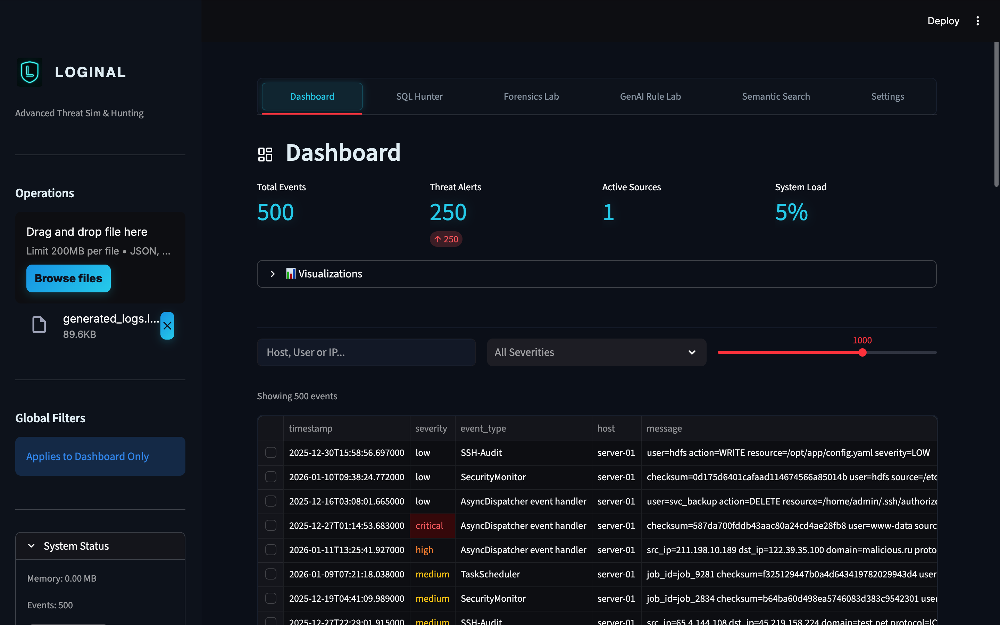
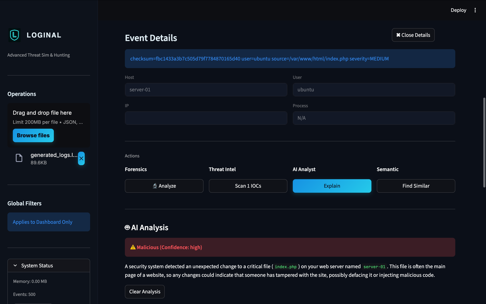
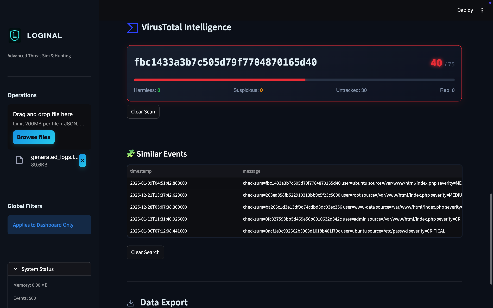
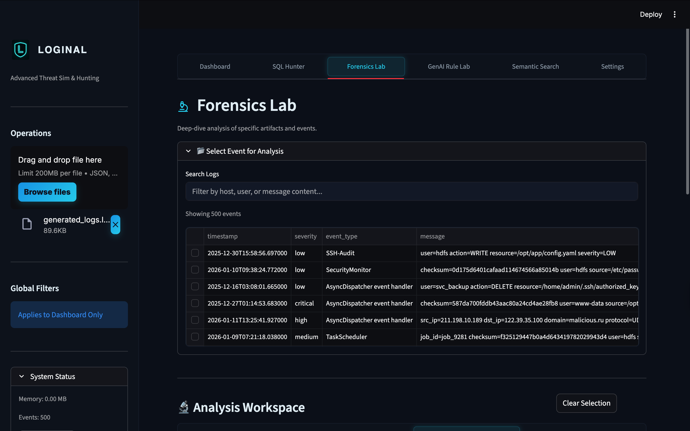
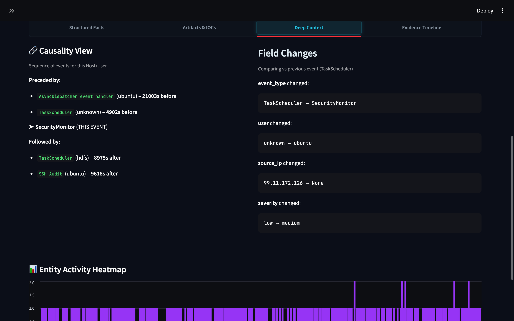
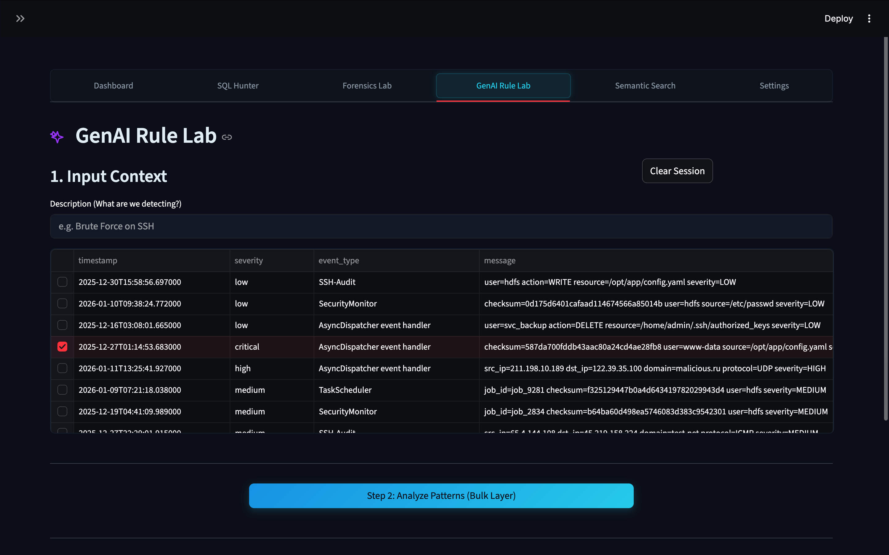
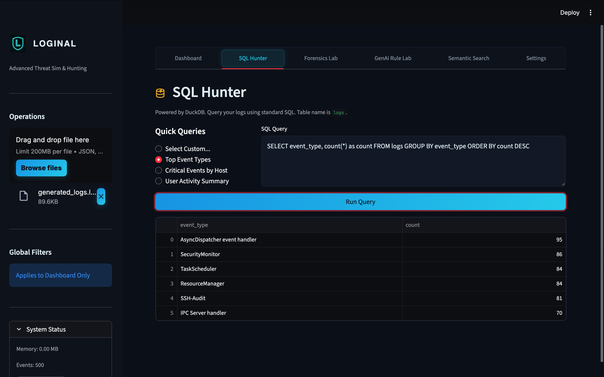
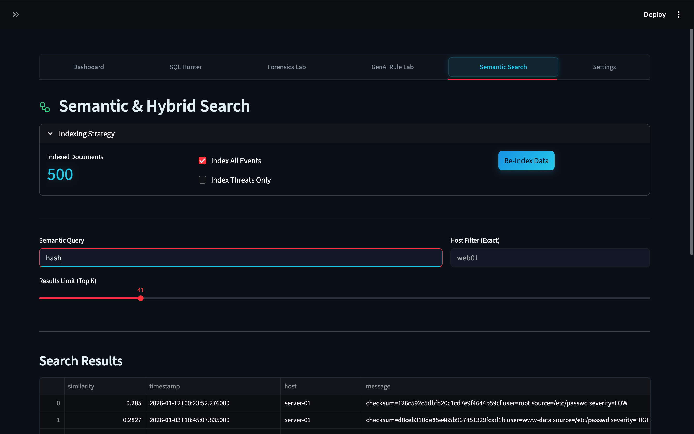

# Loginal

**Loginal** is an advanced, modular security operations platform designed for the modern SOC. It unifies log ingestion, real-time threat detection, and interactive forensics into a single, cohesive interface.

Built with performance and usability in mind, Loginal bridges the gap between CLI power tools and visual dashboards, offering a seamless workflow for threat hunters and security researchers.

  

---

## 📸 System Overview

Loginal's interface is divided into specialized operational zones. Below is a tour of the capabilities.

### 1. Operations Dashboard
The **Command Center**. Get a real-time pulse of your environment with live log streaming, severity-based highlighting, and rapid filtering.

| **Live Feed & Metrics** | **Interactive Filtering** |
| :---: | :---: |
|  |  |
| *Real-time event stream with severity coding* | *Granular filtering by Host, User, or Event Type* |

<div align="center">
  
  <p><em>Detailed Event Inspection with Quick Actions</em></p>
</div>

<br>

### 2. Forensics Lab
When an alert triggers, take it to the **Lab**. This dedicated workspace functionality provides deep context, automatically extracting artifacts (IPs, Hashes) and building a timeline of related activity.

| **Analysis Workspace** | **Artifact Extraction** |
| :---: | :---: |
|  |  |
| *Structured breakdown of the selected event* | *Automated regex extraction of IOCs* |

<br>

### 3. Advanced Intelligence (AI & SQL)
Go beyond basic logs. Use **SQL Hunter** to query your data like a database, or leverage the **GenAI Rule Lab** to have an AI analyst explain complex attack chains.

| **GenAI Analyst** | **SQL Hunter** |
| :---: | :---: |
|  |  |
| *Natural language explanation of threats* | *Power-user querying via DuckDB* |

<div align="center">
  
  <p><em>Semantic Search: Find events by meaning ("failed login"), not just keywords.</em></p>
</div>

---

## 🚀 Features

- **Unified Schema**: Normalizes Syslog, JSON, and EVTX into a standard, queryable model.
- **Threat Intel Integration**: One-click IOC scanning with VirusTotal.
- **AI-Powered Analysis**: Integrated LLM gateway for explaining security events.
- **Semantic Search**: Vector-based retrieval for finding conceptually similar threats.
- **Pipeline Architecture**: Modular design for Ingest -> Normalize -> Detect -> Visualize.

## 📦 Installation

```bash
# Clone the repository
git clone https://github.com/yourusername/loginal.git
cd loginal

# Install dependencies
pip install -r requirements.txt
# OR
pip install -e .
```

## 🛠️ Usage

### Launching the Dashboard (GUI)
The primary way to interact with Loginal is through the web-based dashboard.

```bash
loginal gui
```
*Access the dashboard at http://localhost:8501*

### CLI Utilities
Loginal maintains a robust CLI for headless operations and automation.

```bash
# Ingest and normalize a log file
loginal ingest /var/log/auth.log --format text

# Run detection rules headless
loginal detect --file /var/log/syslog
```

## 🏗️ Architecture

- **`loginal/gui`**: Streamlit-based reactive frontend.
- **`loginal/ingest`**: High-performance parsers for Text, JSON, and EVTX.
- **`loginal/detect`**: Sigma-style rule engine and anomaly detection.
- **`loginal/semantic`**: Vector embeddings and semantic cluster analysis.

## 🤝 Contributing
Contributions are welcome! Please check the `issues` tab for roadmap items.
